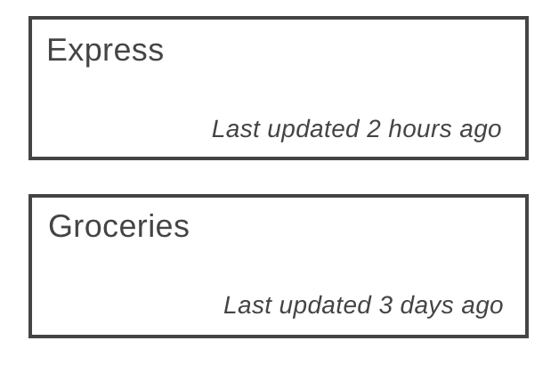
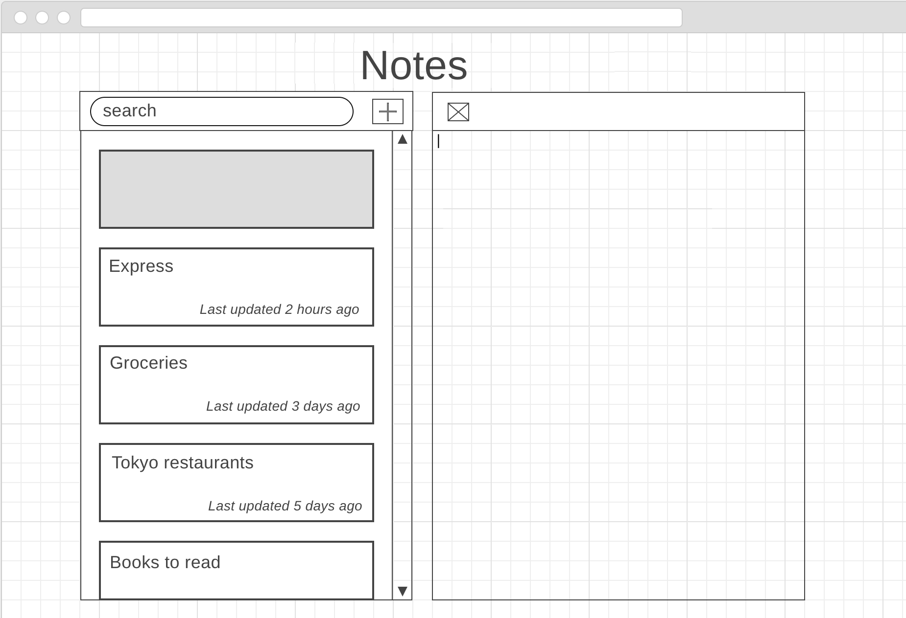

# Code Chrysalis Interview Assessment Part 2

  

## 💡 概要

フルスタックアプリを実装していただきます。

下記の要件をすべて満たした場合、UI のブラッシュアップや他の機能を追加して、アプリをさらに魅力的にしてください。

## ✅ 要件

### 🛠️ 使用技術

下記の技術を使用してください。（ライブラリの追加は可）

| 領域 | 使用技術 | 補足 |
| -------- | -------- | -------- |
| フロントエンド | React | - |
| サーバサイド | Node.js | ご自由にフレームワークを選択してください（Express.js 推奨）|
| データベース | PostgreSQL | リレーショナルデータベースであればその他でも可|
| ORM | Knex.js | その他ライブラリでも可 |
| デプロイ | - | ご自由にデプロイ先を選択してください |
| テスト | Mocha/Chai | その他ライブラリでも可 |
| ソース管理 | Git | - |
| その他 | TypeScript | 任意 |

### 🎨 フロントエンド

- [ ] アプリの左側にはノートカードリストがあり、右側には現在選択されているノートのテキストを表示したノート作成スペースを表示してください

  

- [ ] ノートカードリストは、最終更新日時でソートしてください
- [ ] 各ノートカードは、ノートのタイトルと最終更新日時を表示してください
- [ ] ノートのタイトルは、ノート作成スペースの最初の行を使用してください
- [ ] タイトルが長すぎる場合、ノートカードに収まる最初の数文字のみを表示してください

  

- [ ] "+" ボタンをクリックした場合、左側に空白のノートカードを作成し、右側に空白のノート作成スペースを作成してください
- [ ] ノート作成スペースはテキストを書き込むことができます
- [ ] ノート作成スペースに書き込みがあった場合、左側の対応するノートカードも更新する必要があります
- [ ] "x" ボタンをクリックすると、ノートカードリストからノートが削除されます
- [ ] ノート削除後、ノートカードリストとノート作成スペースの表示は、次に利用可能なノートが選択されている状態になります

  

 

  

- [ ] ノートは自動保存される必要があります
- [ ] キーボードに動きがない場合、5秒ごとにノートを保存してください
- [ ] 別のノートに切り替えたときも保存してください
- [ ] 保存ができたら、ノート作成スペース上に "Saved" というテキストを表示してください

  

  

- [ ] 検索バーを作成し、入力された文字列でノートを検索できるようにしてください
- [ ] 検索にヒットしたノートカードのみをノートカードリストに表示してください

### 🌐 サーバサイド

- [ ] クライアントに必要な API エンドポイントを実装してください
- [ ] 大枠のエンドポイントは、
  - 全ノートの取得
  - ノートの作成・読み込み
  - ノートの更新
  - ノートの削除
- [ ] 必要に応じてエンドポイントを追加・編集してください
- [ ] RESTful API または GraphQL のどちらを使用しても構いません

### 💿 データベース

- [ ] seed ファイルを作成してください
- [ ] migration ファイルを作成してください
- [ ] package.json に db:seed と db:migration スクリプトを配置して、データベースの seed と migration を実行できるようにしてください

### 🚀 デプロイ

- [ ] デプロイ先を [DEPLOY.md](./my-app/DEPLOY.md) に記入してください

### ✨ その他

- [ ] 実装したアプリは [my-app](./my-app/) 配下に配置してください
- [ ] フロントエンドのテストを実装してください
- [ ] サーバサイドのテストを実装してください
- [ ] アプリをローカルで起動できるように、package.json に必要なスクリプトを配置してください
- [ ] 工夫した点やアピールポイントを [SELF_EVALUATION.md](./my-app/SELF_EVALUATION.md) に記入してください
